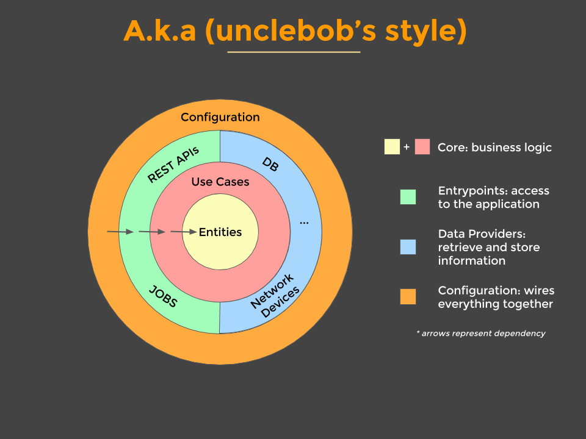

# Flutter Clean Architecture
___

One of the **most important** things in programming is how to make your app code **clean & organized**

Clean Architecture will make your code:
- Reusable
- Clean
- Easy to unit test

We will implement **Robert C. Martin Clean Architecture Principle**

We will divide our code into **multiple Layers** that communicates with each other where **outer layers depends on inner layers**

